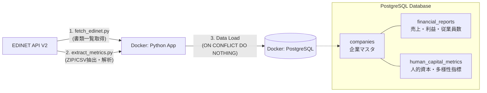

# EDINET Data Pipeline - 人的資本×財務データ 分析基盤

このプロジェクトは、**EDINET API（V2）** を活用して、日本国内の上場企業の「有価証券報告書」から財務指標および**人的資本に関する指標（女性管理職比率、男性育休取得率など）** を自動抽出・蓄積し、将来的な統計分析やダッシュボード構築の土台となるデータパイプラインです。

## 💡 プロジェクトの目的・背景
近年、投資家やステークホルダーからの関心が高まっている**「エンゲージメント（人的資本）と業績・企業価値の相関」**というテーマに対して、データドリブンなアプローチでアセスメントするための基盤（Data Warehouse）として設計しました。

手作業での情報収集を手放し、EDINET APIからXBRL/CSV形式の生データを自動取得・解析するプログラムを実装することで、データエンジニアリングの基礎である**ETL（Extract, Transform, Load）**のフローを構築しています。

## 🛠 技術スタック
- **言語・ライブラリ**: Python 3.10, pandas (データ解析・クレンジング), requests
- **データベース**: PostgreSQL 15, psycopg2
- **インフラ・環境**: Docker, Docker Compose
- **外部API**: EDINET API V2 (CSV取得対応)

## 📊 システムアーキテクチャ



## 🗂 ディレクトリ構成
```text
edinet_data_pipeline/
├── .env.example         # EDINET APIキーの設定例
├── docker-compose.yml   # データベースとアプリケーションコンテナの統合管理
├── Dockerfile           # Pythonコンテナの環境構築
├── init.sql             # 正規化された3テーブルのDDL定義（初回起動時自動実行）
├── requirements.txt     # Python依存パッケージ
├── README.md            
└── src/
    ├── fetch_edinet.py    # 指定日の提出書類一覧をAPIから取得し、DB(企業マスタ)へ登録
    └── extract_metrics.py # 対象書類のZIPをダウンロードし、CSVから財務・人的資本データを抽出
```

## 🌟 注目ポイント（ポートフォリオとしてのアピール要素）
1. **API v2のモダンな機能の活用**
   - 2024年に拡充されたEDINET APIのCSVダウンロード（`type=5`）機能をいち早く組み込み、泥臭いXBRLパース開発の工数を抑えつつ、いち早くビジネス価値（データ抽出）に直結させています。
2. **オンメモリでのZIP解凍・解析処理**
   - ダウンロードした大量のZIPファイルをローカルディスクに保存し続けるのではなく、`io.BytesIO` と `zipfile` モジュールを使ってすべてオンメモリで展開・パースしています。コンテナのストレージ圧迫やI/Oボトルネックを防ぐ堅牢な実装を意識しました。
3. **拡張性を見据えたRDB設計**
   - BIツールでの分析を前提とし、「企業マスタ」「期間ごとの財務データ」「人的資本指標」を論理的に分離・正規化しました。SQLによる柔軟なJOIN・Group By集計ができるように `init.sql` でスキーマを定めています。
4. **べき等性の担保**
   - パイプラインが途中で失敗しても何度でも安全に再実行できるように、PostgreSQLの `ON CONFLICT DO NOTHING` （または UPDATE）を設計に盛り込み、データの重複登録（Duplicate Key）を防いでいます。

## 🚀 セットアップと実行手順

### 1. EDINET APIキーの設定
まず `.env.example` をコピーして `.env` を作成し、[EDINET 開発者向けサイト](https://api.edinet-fsa.go.jp/api/auth/index.aspx?mode=1) で取得したAPIキーを設定します。

```bash
cp .env.example .env
```

`.env`
```env
EDINET_API_KEY=your_edinet_api_key_here
```

`docker-compose.yml` では `.env` を `app` コンテナへ読み込むようにしているため、以降の `docker compose exec` でそのまま利用できます。

**EDINET APIキー発行ページで画面が開かない場合**

ログイン後、APIキー表示画面がポップアップで開く挙動になっているため、ブラウザでポップアップをブロックしているとAPIキー画面が表示されないことがあります。

Chrome の場合は `設定` → `プライバシーとセキュリティ` → `サイトの設定` → `ポップアップとリダイレクト` から、次の URL を許可リストに追加してください。

```text
https://api.edinet-fsa.go.jp
```

その後に再度アクセスすると、ポップアップ画面でAPIキーを確認できます。

### 2. コンテナのビルドとDB初期化
```bash
docker compose up -d --build
```

### 3. パイプラインの実行
**(1) 書類一覧の取得（Extractの起点）**
指定した日付の書類リストを取得し、`companies`テーブルへのマスタ登録、および`financial_reports`への空枠（対象書類ID）登録を行います。このプロジェクトでは、通常の上場企業の有価証券報告書に寄せるため、`ordinanceCode=010` かつ `formCode=030000` の標準帳票だけを対象にしています。EDINET 側で `csvFlag=1` の書類だけが後続の CSV 抽出対象になります。
```bash
docker compose exec app python src/fetch_edinet.py
```

**(2) 実データのダウンロードとDBへの抽出・ロード（Transform & Load）**
XBRLに紐づくCSVデータをAPIからZIPとして要求し、売上・利益・従業員数・人的資本指標などの数値を安全にパースして挿入します。CSV 非対応の書類は自動でスキップされ、処理済みの書類は再実行時に繰り返し対象になりません。
```bash
docker compose exec app python src/extract_metrics.py
```

## 🔎 確認用SQL

### 1. 取り込み件数の確認
```bash
docker compose exec db psql -U user -d edinet_db -c "
SELECT COUNT(*) AS companies FROM companies;
SELECT COUNT(*) AS reports FROM financial_reports;
SELECT COUNT(*) AS human_metrics FROM human_capital_metrics;
"
```

### 2. 財務データの確認
```bash
docker compose exec db psql -U user -d edinet_db -c "
SELECT
  fr.doc_id,
  c.company_name,
  fr.sales,
  fr.operating_profit,
  fr.net_profit,
  fr.employee_count
FROM financial_reports fr
JOIN companies c USING (edinet_code)
WHERE fr.processed IS TRUE
ORDER BY fr.sales DESC NULLS LAST
LIMIT 20;
"
```

### 3. 人的資本データの確認
```bash
docker compose exec db psql -U user -d edinet_db -c "
SELECT
  c.company_name,
  hm.fiscal_year,
  hm.female_manager_ratio,
  hm.male_childcare_leave_ratio,
  hm.gender_wage_gap
FROM human_capital_metrics hm
JOIN companies c USING (edinet_code)
ORDER BY hm.fiscal_year DESC, c.company_name
LIMIT 20;
"
```

### 4. 財務データと人的資本データを結合して確認
```bash
docker compose exec db psql -U user -d edinet_db -c "
SELECT
  c.company_name,
  fr.fiscal_year,
  fr.sales,
  fr.operating_profit,
  hm.female_manager_ratio,
  hm.male_childcare_leave_ratio,
  hm.gender_wage_gap
FROM financial_reports fr
JOIN companies c USING (edinet_code)
LEFT JOIN human_capital_metrics hm
  ON hm.edinet_code = fr.edinet_code
 AND hm.fiscal_year = fr.fiscal_year
WHERE fr.processed IS TRUE
ORDER BY fr.sales DESC NULLS LAST
LIMIT 20;
"
```

## 📈 今後の展望
- Tableau等のBIツールを直接PostgreSQLに接続し、「人的資本の充実度と利益率の相関」を可視化するダッシュボードを構築。
- Apache Airflow（またはMage.ai）への移行による、バッチ処理（Cronジョブやタスクごとの依存関係整理）の完全自動化。
